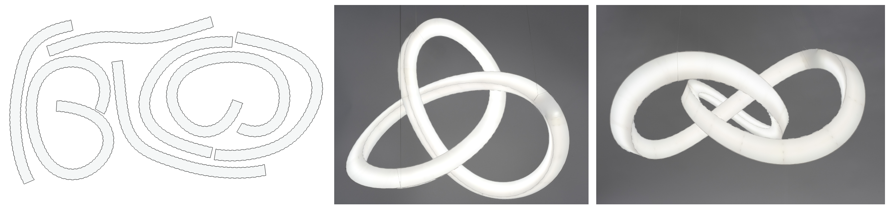

<p align="center">

  <h1 align="center">C-Tubes: Design and Optimization of Tubular Structures Composed of Developable Strips</h1>

  

  <p align="center">
    <a href="https://people.epfl.ch/michele.vidulis?lang=en"><strong>Michele Vidulis*</strong></a>
    · 
    <a href="https://klaramundilova.com/"><strong>Klara Mundilova*</strong></a>
    · 
    <a href="https://qbecky.github.io/"><strong>Quentin Becker*</strong></a>
    · 
    <a href="https://people.epfl.ch/florin.isvoranu"><strong>Florin Isvoranu</strong></a>
    · 
    <a href="https://people.epfl.ch/mark.pauly"><strong>Mark Pauly</strong></a>
    <br />
    (* denotes equal contribution)
  </p>
</p>

<p align="center">
  <a href='https://infoscience.epfl.ch/entities/publication/797b6605-04d1-4632-9f1b-bb3cfdade33a'>
    
  </a>
  <a href='https://go.epfl.ch/c-tubes/' style='padding-left: 0.5rem;'>
    
  </a>
</p>


## About

This repository contains the source code and data for [C-Tubes: Design and Optimization of Tubular Structures Composed of Developable Strips](https://go.epfl.ch/c-tubes/), published at SIGGRAPH 2025.


## Installation

Clone the repository recursively:

```bash
git clone --recurse-submodules git@github.com:EPFL-LGG/C-tubes.git
```

If you already cloned the repository without the `--recurse-submodules` flag, run:

```bash
git submodule update --init --recursive
```

To create a conda environment and install the dependencies run:

```bash
conda env create -f environment.yml
conda activate C-tubes
```

Install the `Ctubes` package in editable mode:

```bash
pip install -e .
```

[pytorch3d](https://pytorch3d.org/), used in the minimal surface example in `notebooks/figures/fig17_min_surf.ipynb`, can be optionally installed via pip:

```bash
pip install "git+https://github.com/facebookresearch/pytorch3d.git"
```

For development, installing the `nbstripout` git filter is recommended to avoid committing large outputs in Jupyter notebooks:

```bash
nbstripout --install
```

## Running the Code

With the conda environment activated, you can run a Jupyter notebook by starting a Jupyter Lab server in the repository root folder:

```bash
jupyter lab
```

The notebook `notebooks/demo.ipynb` provides a quick overview of the main features of the codebase.

To reproduce the figures in the paper, run the notebooks in `notebooks/figures/`.

To execute all the notebooks in `notebooks/figures/` at once and generate all the data from the paper, run:

```bash
cd notebooks/figures
python run_all.py
```


## Citation

If you use this codebase in your project, please consider citing our work:
```
@article{10.1145/3730933,
  author = {Vidulis, Michele and Mundilova, Klara and Becker, Quentin and Isvoranu, Florin and Pauly, Mark},
  title = {C-Tubes: Design and Optimization of Tubular Structures Composed of Developable Strips},
  year = {2025},
  issue_date = {August 2025},
  publisher = {Association for Computing Machinery},
  address = {New York, NY, USA},
  volume = {44},
  number = {4},
  issn = {0730-0301},
  url = {https://doi.org/10.1145/3730933},
  doi = {10.1145/3730933},
  month = jul,
  articleno = {154},
  numpages = {19}
}
```